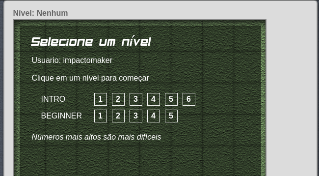

Code Commander
==============

This is a simple webapp that allows a young learner to begin practicing programming.

The application takes the form of a game in which the user attempts to program a 
tank to move to and blow up a building.

It is based on jQuery, Crafty, and HTML5, and thus requires a fairly modern (ie non-IE) browser.

# Sobre o Jogo

O Game possui todas as intruções que são necessárias no próprio comando de ```Ajuda``` que está no Jogo no canto superior direito.

## Sobre a promoção da Colônia de Férias Impacto Maker.

A Impacto Maker vai garantir descontos para todos os inscritos que conseguirem realizar **TODAS** as atividades na categoria **BEGINNER** no *Code Commander*.

Para que o desconto seja válido os pais ou responsáveis terão que mandar um print com a tela dos níveis aonde aparece também o *username* do aluno.

O print deverá ser semelhante a esse:



Para exibir esta tela clique em "Escolher Nível", abaixo do *Console.*

OBS: A ideia do jogo é que o(a)(s) filho(a)(s) e seus pais possam juntos resolver os problemas dispostos no Jogo, então aproveite esse momento para aprenderem juntos!

## Mais informações

[Clique aqui, para saber mais sobre a Colônia de Férias da Impacto Maker.](https://www.sympla.com.br/oficina-de-ferias---impacto-maker__304978)

